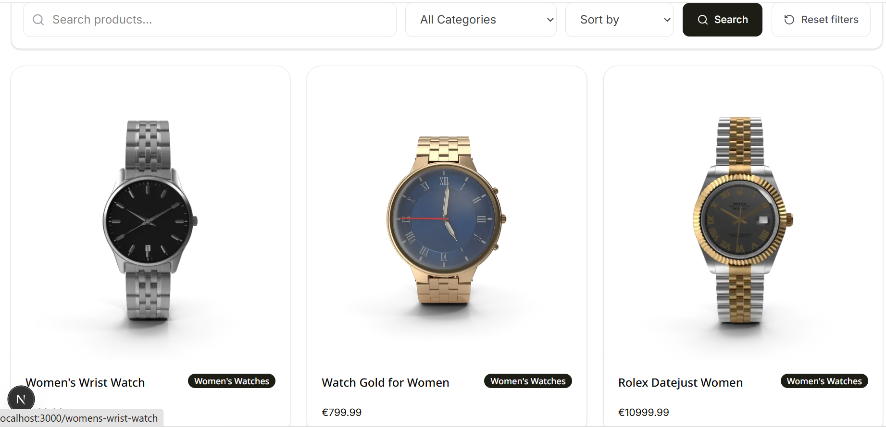
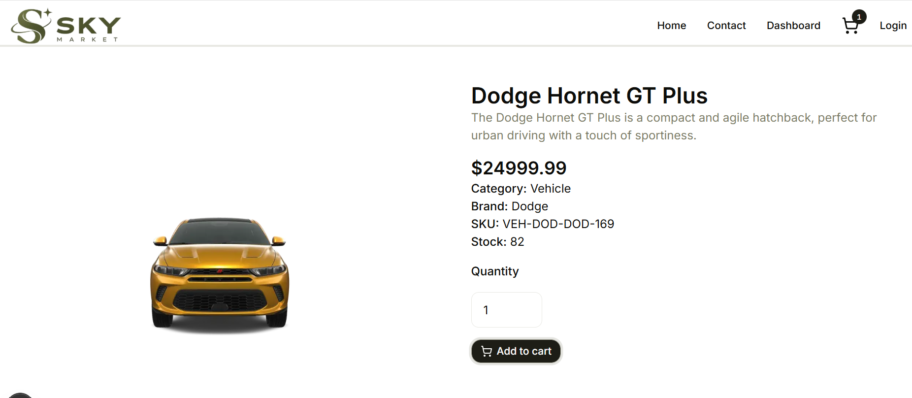
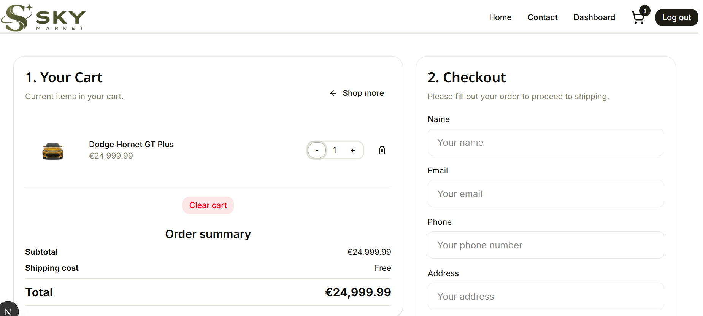
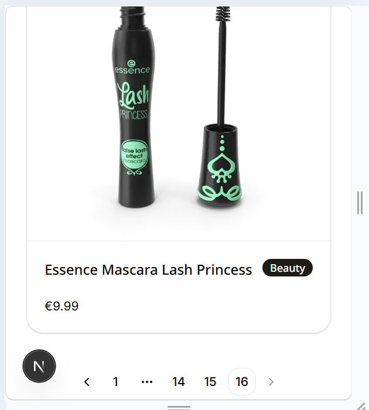

# Sky Market

Sky Market is an e-commerce web application built with Next.js App Router and TypeScript.
Users can browse, search, filter, sort, paginate products, view product details, manage their shopping cart.
The user can create an account och login to browse order history. As an Admin you can log in to an admin dashboard 
where the Admin can edit/delete products and also create a new product with uploads of image and thumbnail.

Sky Market uses PostgreSQL (Supabase) as its database and Prisma 7 ORM to manage database access and data.

## Table of Contents

- [Features](#features)
- [Usage](#usage)
- [Getting Started](#getting-started)
- [Architecture](#architecture)
- [Screenshots](#screenshots)
- [Technologies](#technologies)
- [Environment Variables](#environment-variables)
- [Database Setup](#database-setup)
- [User Account Setup](#user-account-setup)
- [Admin Account Setup](#admin-account-setup)
- [Deloyment on Vercel](#deployment-on-vercel)
- [Future Additions](#future-additions)
- [Definition of Done](#definition-of-done)
- [License](#license)
- [Authors](#authors)
- [Resource](#resources)

## Features

- Browse products
- Search, filter, sort products with Pagination
- View product details
- Add products to the shopping cart
- Update quantities, remove products, and clear the cart with confirmation
- View order summary and checkout
- A User can create a user account or login. There is also a reset-password feature.
- As an Admin edit/delete products and also create a new product with uploads of image and thumbnail from the admin dashboard.
- The whole website is responsive and checked to the lowest width at 360px.
- The accessibility has been checked with WAVE (Web Accessibility Evaluation Tool) and Google Lighthouse

## Usage

1. Open the application.
2. Browse, search, filter, or sort products.
3. Click on a product to view its details.
4. Add products to the shopping cart.
5. Update quantities or remove products from the cart.
6. Review the order summary and proceed to checkout.
7. Create an account or log in to access account features.

## Getting Started

First, install the dependencies:

```bash
npm install

```

To start the development server, run:

```bash
npm run dev
```

Open your browser and go to `http://localhost:3000` to view the application.


## Architecture

- Sky Market is built with Next.js using the App Router with TypeScript.
- UI is made by Tailwind CSS, Shadcn/UI, and Lucid Icons.
- Database is managed by Prisma 7 ORM and Supabase (postgreSQL).
- Auth is managed by Session Cookies with BetterAuth.
- For validation, we use Zod.
- For file uploads, we use Sharp lib. Which crop larger uploaded images (1000x1000ps) and thumbnails (300x300px) to the correct size.
- You can upload images in jpg, png, and webp formats. If uploading jpg or png, the image will be converted to webp format.
- All images and thumbnails are renamed during upload to the related product-slug.
- Product images are stored in the public/images folder, and thumbnails are stored in the public/thumbnails folder.

The project is organized into separate areas for pages, reusable components, services, server logic, and database functionality.

### Project Structure

```text

app/          - Pages, routes, loading, errors, not-fount, favicons, layouts and Auth.
actions/      - Server actions for handling form submissions and data manipulation
components/   - Reusable React components
data/         - Contains products.json file used when seeding the database
docs/         - Documentation for the project
generated/    - Generated Prisma client and files
hooks/        - Custom hooks for managing state and logic
lib/          - Third-party libraries, utilities and application logic
mapping/      - Mapping functions for data transformation and manipulation
prisma/       - Database schema, migrations, and seed script 
public/       - Static files and images
repositories/ - Repository functions for interacting with the database
schemas/      - Data schemas for Zod validation and type checking
types/        - TypeScript types and interfaces
utils/        - Reusable utilities functions
```

## Screenshots











## Technologies

- Next.js App Router 16
- React.js 19
- TypeScript 5
- Tailwind 4 CSS
- Prisma 7 ORM
- PostgreSQL 18
- Better Auth 1.7.6
- Shadcn/ui 4.21
- Zod 4.6.5
- Sharp 0.35.4

## Environment Variables

Create a `.env` file in the root of the project and add the following environment variables:

```env
DATABASE_URL=
DIRECT_URL=
BETTER_AUTH_SECRET=
BETTER_AUTH_URL=
RESEND_API_KEY=
CONTACT_EMAIL=
```

> Never commit your `.env` file or expose secret values.

### Database Setup

Generate the Prisma client:

```bash
npm run prisma:generate
```
Run the database migrations:

```bash
npm run prisma:migrate
```

Seed the database with product data from `/data/products.json`
The `/prisma/seed.ts` script will create a product slug based on the product title.

```bash
npm run seed
```

To view the database tables and data from Prisma Studio:

```bash
npm run prisma:studio
```

### User Account Setup

- There are no seeded Users in the database.
- Run the application and sign up as a new user.

### Admin Account Setup

- There are no seeded Admins in the database.
- Run the application and sign up as a new user.
- When the user is created. Open up Prisma Studio to assign the user the Admin role.

## Deloyment on Vercel

(https://webshop-frontend-2.vercel.app/)

## Future Additions

- Continue improving responsive design across the application.
- Add and update screenshots as the application develops.
- Continue improving the customer and admin experience.
- Add order tracking, order confirmation (web and email) with order number and payment instructions.
- Implement additional optimization and performance.
- Implement Stripe Payments.
- Implement Testing with Playwright and Vitest

## Definition of Done

- The feature has been tested by two group members on the relevant branch through PR review.
- The acceptance criteria are fulfilled.
- The code is complete and understandable.
- TypeScript compiles without errors.
- ESLint has no relevant errors.
- The feature works together with the rest of the application.
- The feature has been merged into the group's shared development branch.
- No known critical errors remain. 
- The GitHub issue has been updated.
- The application is fully function without errors when: npm run build && npm run start
- The application has been successfully deployed to Vercel.

## License

This project is licensed under the MIT License.

## Authors

- Patrik Idén (https://github.com/patrikiden-dev)
- Lizzy van Rhijn (https://github.com/LizzyonGit)
- Leo Leksell (https://github.com/leo98lxl)
- David Söderberg (https://github.com/dame9785)
- Perjin Shavani (https://github.com/perjinshavani)


## Resources

- Next.js App Router (https://nextjs.org/docs/app)
- React.js (https://react.dev/)
- Zod (https://zod.dev/)
- Sharp (https://sharp.pixelplumbing.com/)
- BetterAuth (https://better-auth.com/)
- Prisma (https://www.prisma.io/)
- Supabase (https://supabase.com/)
- Vercel (https://vercel.com/)
- Tailwind (https://tailwindcss.com/)
- Shadcn/ui (https://ui.shadcn.com/)
- PostgreSQL (https://www.postgresql.org/)
- TypeScript (https://www.typescriptlang.org/)
- Lucid Icons (https://lucide.dev/)
- TinyPNG (https://tinypng.com/)
- ChatGPT (https://chatgpt.com/)
- Copilot (https://copilot.com/)

