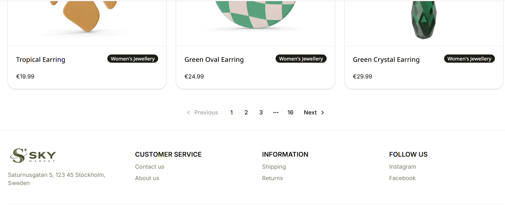
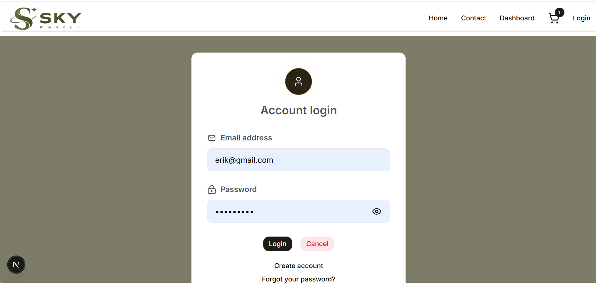

# Sky Market

Sky Market is an e-commerce web application built with Next.js, React, and TypeScript.
Users can browse, search and filter products, view product details, manage their shopping cart, and create an account.


This project uses [json-server](https://github.com/typicode/json-server/tree/v0.17.4) to mock a backend API.

Data in the JSON for the server is from [dummyjson.com](https://dummyjson.com/docs/products) but modified to fit the needs of this project. Most of the endpoints mirrors those in that documentation.

## Table of Contents

- [Features](#features)
- [Usage](#usage)
- [Getting Started](#getting-started)
- [JSON Server Setup](#json-server-setup)
- [API Endpoints](#api-endpoints)
- [Architecture](#architecture)
- [Screenshots](#screenshots)
- [Technologies](#technologies)
- [Environment Variables](#environment-variables)
- [Learn More](#learn-more)
- [Definition of Done](#definition-of-done)
- [Authors](#authors)

## Features

- Browse products
- Search, filter and sort products
- View product details
- Add products to the shopping cart
- Update quantities, remove products and clear the cart with confirmation
- View order summary and checkout
- Create a user account
- Log in and manage authentication

## Usage

1. Open the application.
2. Browse, search, filter, or sort products.
3. Click on a product to view its details.
4. Add products to the shopping cart.
5. Update quantities or remove products from the cart.
6. Review the order summary and proceed to checkout.
7. Create an account or log in to access account features.


## Getting Started

First, install the dependencies:

```bash
npm install

```

To start the development server, run:

```bash
npm run dev
```

Open your browser and go to `http://localhost:3000` to view the application.

The JSON server is running on [http://localhost:4000](http://localhost:4000). Here you can see the API endpoints and test them.


## JSON Server Setup

This project uses [json-server](https://github.com/typicode/json-server/tree/v0.17.4) to mock a backend API.

### Configuration

The server configuration files are located in the `server/` directory:

-   `server/products.json`: The database file containing the product data.
-   `server/middleware.js`: Custom middleware for the server.

### Scripts

The following scripts are available in `package.json`:

-   `npm run mock-server`: Starts the json-server on port 4000.
-   `npm run dev:full`: Runs both the Next.js development server and the json-server concurrently.

## API Endpoints

The mock server (running on port 4000) provides the following endpoints:

### Resources
- `GET /products`: Get all products
- `GET /products/:id`: Get a single product by ID
- `GET /categories`: Get all categories
- `GET /categories/:id`: Get a category by ID
- `GET /categories?slug=:slug`: Get a category by slug

### Create Product
- `POST /products`: Create a new product

**Required Fields:**
- `title`: String
- `price`: Number
- `description`: String
- `thumbnail`: URL String
- `categoryId`: Number (ID of an existing category)
- `brand`: String

**Auto-generated Fields:**
- `id`: Sequential ID
- `sku`: Generated SKU (format: CAT-BRA-TIT-ID)
- `meta`: Creation and update timestamps

### Pagination & Sorting (json-server 0.17.4)
See [json-server documentation](https://github.com/typicode/json-server/tree/v0.17.4) for more information.

#### Pagination

Use `_page` and `_limit` to paginate data:

- `GET /products?_page=1&_limit=12` (First page, 12 items)
- `GET /products?_page=2&_limit=12` (Second page, 12 items)

The response will include the `Link` header with `first`, `prev`, `next`, and `last` links.
Our custom middleware also adds `X-Total-Count` header and wraps the response to include pagination metadata (total, limit, page, pages).

#### Sorting

Use `_sort` and `_order` to sort data:

- `GET /products?_sort=price&_order=asc` (Sort by price, ascending)
- `GET /products?_sort=price&_order=desc` (Sort by price, descending)
- `GET /products?_sort=price,title&_order=desc,asc` (Sort by multiple fields)

#### Filtering
- `GET /products?price_gte=10&price_lte=50` (Price between 10 and 50)
- `GET /products?q=mascara` (Full-text search)

## Architecture

Sky Market is built with Next.js using the App Router and React with TypeScript.

The project is organized into separate areas for pages, reusable components, services, server logic, and database functionality.

### Project Structure

```text

app/          - Pages, routes, API routes, and layouts
components/   - Reusable React components
services/     - Application services
prisma/       - Database schema and database setup
server/       - JSON Server data and middleware
public/       - Static files and images
lib/          - Shared utilities and application logic
```

## Screenshots







## Technologies

- Next.js
- React
- TypeScript
- Tailwind CSS
- Prisma
- PostgreSQL
- Better Auth
- shadcn/ui

## Environment Variables

Create a `.env` file in the root of the project and add the following environment variables:

```env
DATABASE_URL=
DIRECT_URL=
BETTER_AUTH_SECRET=
BETTER_AUTH_URL=
RESEND_API_KEY=
CONTACT_EMAIL=
```

> Never commit your `.env` file or expose secret values.

### Database Setup

Generate the Prisma client:

```bash
npm run prisma:generate
```
Run the database migrations:

```bash
npm run prisma:migrate
```

## Learn More

To learn more about Next.js, take a look at the following resources:

- [Next.js Documentation](https://nextjs.org/docs) - learn about Next.js features and API.
- [Learn Next.js](https://nextjs.org/learn) - an interactive Next.js tutorial.

## Future Additions

- Continue improving responsive design across the application.
- Add and update screenshots as the application develops.
- Continue improving the customer and admin experience.


## Definition of Done

- The feature has been tested by two group members on the relevant branch through PR review.
- The acceptance criteria are fulfilled.
- The code is complete and understandable.
- TypeScript compiles without errors.
- ESLint has no relevant errors.
- The feature works together with the rest of the application.
- The feature has been merged into the group's shared development branch.
- No known critical errors remain.
- The GitHub issue has been updated.
- The application has been successfully deployed to Vercel.

## License

This project is licensed under the MIT License.

## Authors
-[Patrik Idén](https://github.com/patrikiden-dev)
-[Lizzy van Rhijn](https://github.com/LizzyonGit)
-[Leo Leksell](https://github.com/leo98lxl)
-[David Söderberg](https://github.com/dame9785)
-[Perjin Shavani](https://github.com/perjinshavani)


